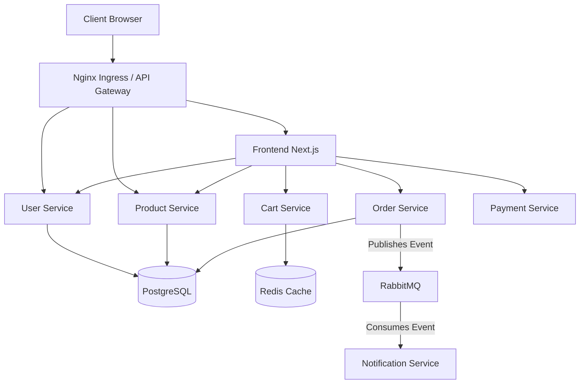
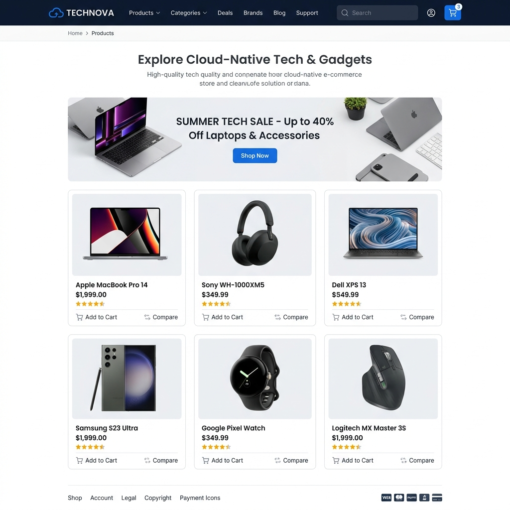
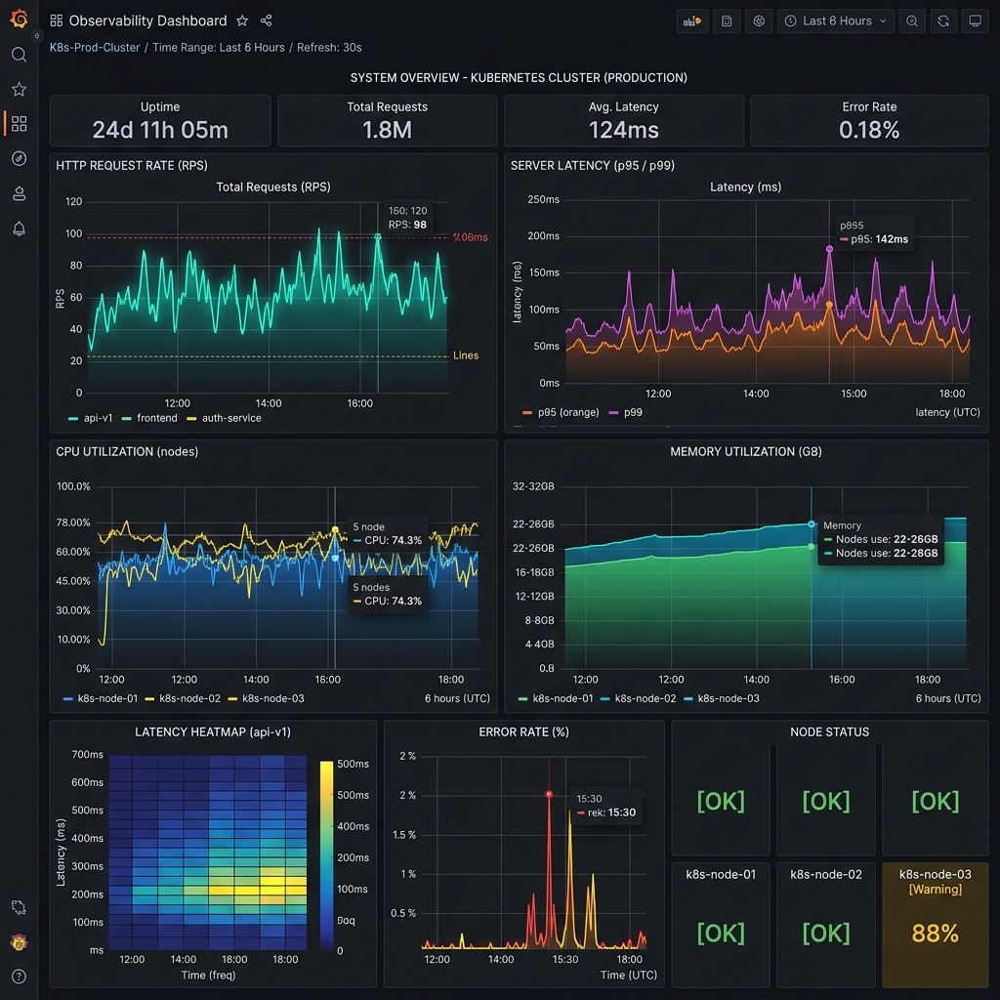

# Cloud-Native E-commerce Platform

# Cloud Support & Production Operations Practice

This project is a production-style cloud operations and support practice environment built to demonstrate real-world troubleshooting, monitoring, incident handling, and deployment support skills.

The focus of this project is not only application deployment, but also day-to-day production support activities such as monitoring, log analysis, service health checks, incident investigation, root cause analysis, and recovery actions.

## Environment Overview

The platform includes containerized microservices deployed using Docker and Kubernetes, with monitoring and troubleshooting workflows built around Linux, Kubernetes, AWS-style infrastructure, Prometheus, Grafana, and CI/CD pipelines.

## Support Activities Practiced

- Application health monitoring
- Kubernetes pod troubleshooting
- Deployment failure investigation
- Log analysis using Linux and Kubernetes commands
- Container restart and crash investigation
- Service connectivity testing
- Ingress and routing issue debugging
- CI/CD pipeline failure analysis
- Resource usage monitoring
- Incident documentation and RCA preparation
- Rollback and recovery validation

## Tools Used

- Linux
- Docker
- Kubernetes
- AWS EC2
- AWS VPC
- AWS IAM
- AWS Load Balancer
- GitHub Actions
- Jenkins
- Prometheus
- Grafana
- CloudWatch-style monitoring
- NGINX
- PostgreSQL
- curl
- systemctl
- journalctl
- kubectl

## Troubleshooting Commands Used

```bash
kubectl get pods -A
kubectl describe pod <pod-name>
kubectl logs <pod-name>
kubectl get events --sort-by=.metadata.creationTimestamp
kubectl get svc
kubectl describe svc <service-name>
kubectl get ingress
kubectl describe ingress <ingress-name>
kubectl rollout status deployment/<deployment-name>
kubectl rollout restart deployment/<deployment-name>
kubectl top pods
kubectl top nodes
docker ps
docker logs <container-id>
docker exec -it <container-id> /bin/sh
systemctl status nginx
journalctl -u nginx
df -h
free -m
top
ss -tulnp
curl -I http://localhost
nslookup <service-name>
dig <domain-name>

```


===================================================
A production-ready microservices e-commerce application demonstrating Cloud-Native patterns, DevOps best practices, and modern infrastructure deployment.

## Architecture Diagram



## Why this project is relevant for DevOps / SRE roles
This project was designed from the ground up to reflect realistic tech requirements for DevOps and SRE roles:
- **Cloud-Native Microservices:** Event-driven architecture using RabbitMQ, preventing tight coupling between the Order and Notification domains.
- **Kubernetes Production Patterns:** Implementation includes Deployments, StatefulSets, Ingress, Services, ConfigMaps, Secrets, resource limits/requests, and probes (liveness/readiness).
- **CI/CD Automation:** GitHub Actions pipeline configured for automated testing, multi-arch Docker image builds, security scanning (Trivy), and deployment.
- **Infrastructure as Code (IaC):** Terraform modules define the AWS VPC, EKS Cluster, RDS, and ElastiCache components.
- **Observability:** Built-in Prometheus metrics exposition (`prom-client`) for all Node.js services and ready-to-import Grafana dashboards.
- **Security-First Deployment:** Non-root Docker containers, Trivy vulnerability scanning in CI/CD, and JWT-based authentication.
- **Scalable Architecture:** Stateless Node.js backend services designed to be horizontally scaled via Kubernetes HPA.

## Screenshots

### CloudShop Storefront (Next.js)


### Grafana Observability Dashboard


## Folder Structure Explanation
- `/frontend`: Next.js React application.
- `/services`: Node.js Express microservices (user, product, cart, order, payment, notification).
- `/infrastructure`: 
  - `/kubernetes`: Raw YAML manifests for local testing or CI/CD deployment.
  - `/terraform`: AWS IaC configuration.
- `/monitoring`: Prometheus config and Grafana dashboards.
- `/.github/workflows`: CI/CD definitions.
- `/docs`: Detailed explanations and troubleshooting guides.

## Local Setup Guide

### Docker Compose Setup
Run the entire platform locally using Docker Compose:

1. Clone the repository.
2. Copy `.env.example` to `.env` (optional, the example values are defaults).
3. Run the stack:
   ```bash
   docker compose up --build
   ```
4. Access the application:
   - Frontend: `http://localhost:3000`
   - User Service: `http://localhost:3001`
   - Product Service: `http://localhost:3002`

### Testing APIs using cURL

**Get Products:**
```bash
curl http://localhost:3002/api/products
```

**Health Check:**
```bash
curl http://localhost:3001/health
```

## Documentation Links
- [Recruiter Explanation Guide](./docs/interview-explanation.md) - Deep dive into architecture and design choices.
- [Production Debugging Scenarios](./docs/production-debugging-scenarios.md) - 10 realistic SRE/DevOps troubleshooting scenarios.

## Future Improvements
- Implement HashiCorp Vault for secret management.
- Switch to Helm charts for Kubernetes deployments.
- Add OpenTelemetry tracing (Jaeger).
- Add Service Mesh (Istio) for mTLS.
