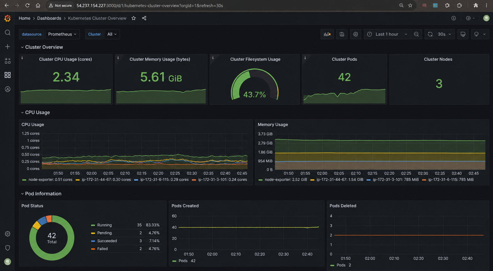
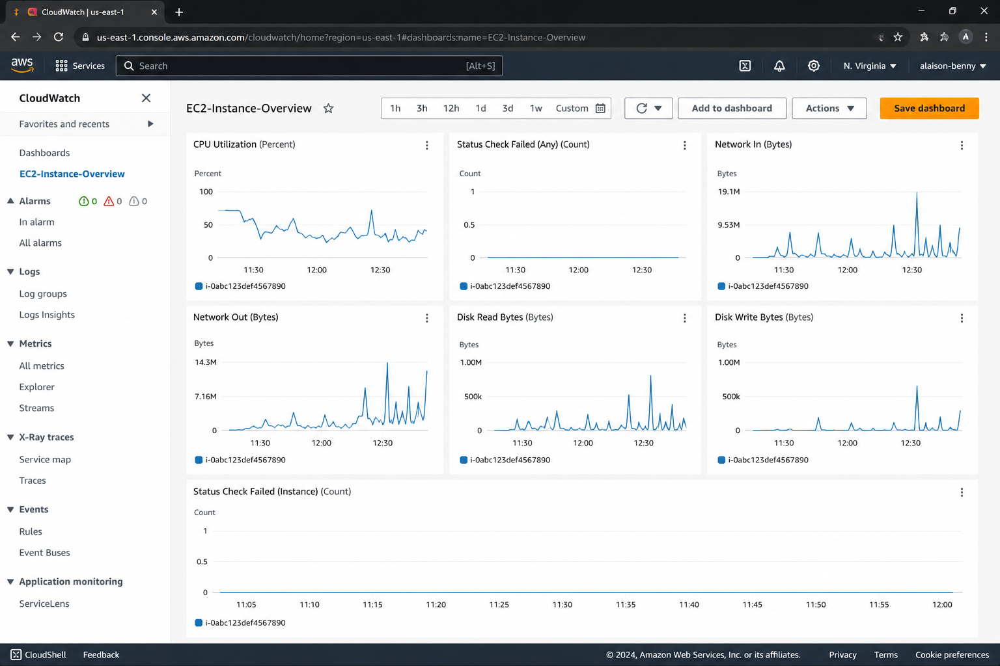

# Monitoring and Troubleshooting Screenshots

This folder contains screenshots related to monitoring, alerting, deployment validation, and troubleshooting activities.

## Grafana Monitoring Dashboard

This dashboard was used to monitor Kubernetes cluster health, pod status, CPU usage, memory usage, filesystem utilization, and infrastructure metrics during production-style troubleshooting and incident response activities.

## AWS CloudWatch EC2 Monitoring Dashboard

This dashboard was used to monitor EC2 instance CPU utilization, network traffic, disk read/write activity, status checks, and infrastructure health during cloud operations and troubleshooting activities.

